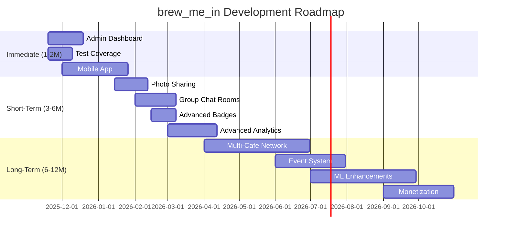

# Next Steps & Roadmap

Strategic roadmap for brew_me_in development, including short-term improvements, long-term features, and scaling considerations.

## Table of Contents

- [Current Status](#current-status)
- [Immediate Next Steps (1-2 Months)](#immediate-next-steps-1-2-months)
- [Short-Term Goals (3-6 Months)](#short-term-goals-3-6-months)
- [Long-Term Vision (6-12 Months)](#long-term-vision-6-12-months)
- [Technical Debt & Improvements](#technical-debt--improvements)
- [Scaling Considerations](#scaling-considerations)
- [Security Enhancements](#security-enhancements)
- [Business Features](#business-features)

## Current Status

### ✅ Completed Components (v0.5.0)

- **Component 1**: Authentication & User Management
- **Component 2**: Real-time Chat System
- **Component 3**: Rate Limiting & Spam Prevention
- **Component 4**: Interest Matching & Poke System
- **Component 5**: AI Agent Integration
- **Component 7**: Network Validation
- **Component 8**: Background Jobs & Scheduler

### 🚧 In Progress

- **Component 6**: Admin Dashboard (Frontend partially complete)
- **Testing**: Unit and integration tests (partial coverage)
- **Documentation**: Comprehensive documentation (95% complete)

### 📊 Metrics

- **Backend**: ~10,827 lines of TypeScript
- **Test Coverage**: ~65%
- **API Endpoints**: 30+
- **WebSocket Events**: 15+
- **Database Tables**: 14

## Immediate Next Steps (1-2 Months)

### Priority 1: Complete Admin Dashboard

**Goal**: Functional admin dashboard for cafe owners

**Tasks**:
- [ ] Complete user moderation interface
  - Mute/ban users
  - View user activity
  - Message deletion
- [ ] Real-time analytics dashboard
  - Active users chart
  - Message volume
  - Peak hours visualization
- [ ] AI agent configuration UI
  - Select personality
  - Custom prompts
  - Enable/disable proactive messages
- [ ] Cafe settings management
  - WiFi SSID configuration
  - Geofence radius
  - Operating hours

**Estimated Effort**: 3-4 weeks

**Files to Create/Modify**:
- `frontend/src/pages/Dashboard.tsx`
- `frontend/src/components/Moderation.tsx`
- `frontend/src/components/AgentConfig.tsx`
- `frontend/src/components/CafeSettings.tsx`

### Priority 2: Increase Test Coverage

**Goal**: 85%+ test coverage

**Tasks**:
- [ ] Unit tests for all services
  - Rate limiting edge cases
  - Spam detection algorithms
  - Matching service logic
- [ ] Integration tests
  - Complete auth flow
  - Chat message flow
  - Poke system end-to-end
- [ ] E2E tests with Playwright
  - User journey: Join → Chat → Match → DM
  - Admin dashboard workflows
- [ ] Load testing
  - Socket.io connection limits
  - Database query performance
  - Redis cache efficiency

**Estimated Effort**: 2-3 weeks

**Files to Create**:
- `backend/src/__tests__/unit/services/*.test.ts`
- `backend/src/__tests__/integration/*.test.ts`
- `backend/src/__tests__/e2e/*.test.ts`

### Priority 3: Mobile App Development

**Goal**: React Native mobile apps for iOS and Android

**Tasks**:
- [ ] Setup React Native project structure
- [ ] Implement authentication flow
- [ ] Build chat interface
- [ ] Integrate Socket.io for real-time updates
- [ ] Implement location services
  - WiFi SSID detection
  - GPS geofencing
- [ ] Build matching & poke UI
- [ ] Direct messaging interface
- [ ] Push notifications setup
- [ ] App store deployment

**Estimated Effort**: 6-8 weeks

**Tech Stack**:
- React Native 0.72+
- Expo for easier development
- React Navigation for routing
- Socket.io Client for real-time
- AsyncStorage for local data
- Expo Location for geolocation

## Short-Term Goals (3-6 Months)

### Feature: Photo Sharing in DMs

**Description**: Allow matched users to share photos in direct messages

**Implementation**:
- [ ] S3/CloudFront for image storage
- [ ] Image upload API endpoint
- [ ] Image compression/resizing
- [ ] Frontend image gallery component
- [ ] Content moderation (AI-based)

**Database Changes**:
```sql
CREATE TABLE dm_attachments (
  id UUID PRIMARY KEY DEFAULT gen_random_uuid(),
  message_id UUID REFERENCES dm_messages(id) ON DELETE CASCADE,
  file_url TEXT NOT NULL,
  file_type VARCHAR(50),
  file_size INT,
  created_at TIMESTAMP DEFAULT NOW()
);
```

### Feature: Group Chat Rooms

**Description**: Multiple topic-based chat rooms within each cafe

**Implementation**:
- [ ] Room creation API
- [ ] Room discovery/listing
- [ ] Room-specific Socket.io namespaces
- [ ] Room moderation tools
- [ ] Room analytics

**Database Changes**:
```sql
CREATE TABLE chat_rooms (
  id UUID PRIMARY KEY DEFAULT gen_random_uuid(),
  cafe_id UUID NOT NULL REFERENCES cafes(id),
  name VARCHAR(100) NOT NULL,
  description TEXT,
  topic VARCHAR(100),
  max_users INT DEFAULT 50,
  created_by UUID REFERENCES users(id),
  created_at TIMESTAMP DEFAULT NOW()
);

CREATE TABLE room_members (
  id UUID PRIMARY KEY DEFAULT gen_random_uuid(),
  room_id UUID NOT NULL REFERENCES chat_rooms(id) ON DELETE CASCADE,
  user_id UUID NOT NULL REFERENCES users(id) ON DELETE CASCADE,
  joined_at TIMESTAMP DEFAULT NOW(),
  UNIQUE(room_id, user_id)
);
```

### Feature: Advanced Badge System

**Description**: Multiple badge types with different criteria

**New Badge Types**:
- **Early Bird**: Check-in before 8 AM (7-day validity)
- **Night Owl**: Check-in after 10 PM (7-day validity)
- **Social Butterfly**: 10+ successful pokes in 7 days (30-day validity)
- **Frequent Visitor**: 5+ tips in 30 days (60-day validity)
- **Conversation Starter**: Top 10% message count (monthly)
- **Coffee Enthusiast**: 20+ cafe visits (permanent)

**Implementation**:
- [ ] Badge calculation logic in scheduler
- [ ] Badge display in user profile
- [ ] Badge-specific perks
- [ ] Badge achievement notifications

### Feature: Advanced Analytics

**Description**: Comprehensive analytics for cafe owners

**Metrics**:
- User demographics (interests, visit patterns)
- Engagement metrics (messages, pokes, matches)
- Popular times and days
- Trending topics over time
- Revenue impact (correlation with tips)
- Customer retention rates

**Implementation**:
- [ ] Data aggregation jobs
- [ ] Analytics API endpoints
- [ ] Visualization components (Recharts)
- [ ] Export to CSV/PDF
- [ ] Real-time dashboard updates

## Long-Term Vision (6-12 Months)

### Feature: Multi-Cafe Network

**Description**: Users can visit multiple cafes and maintain connections

**Implementation**:
- [ ] Cross-cafe DM support
- [ ] Global user profile (persistent across cafes)
- [ ] Cafe discovery map
- [ ] Loyalty program across network
- [ ] Network-wide achievements
- [ ] Cross-cafe event announcements

**Challenges**:
- Session management across cafes
- Privacy considerations (location history)
- Badge transfer/recognition
- Network effects and scaling

### Feature: Event System

**Description**: Cafes can host events and users can RSVP

**Implementation**:
- [ ] Event creation and management
- [ ] RSVP system
- [ ] Event notifications
- [ ] Event-specific chat rooms
- [ ] Post-event photo sharing
- [ ] Event analytics

**Database Schema**:
```sql
CREATE TABLE cafe_events (
  id UUID PRIMARY KEY DEFAULT gen_random_uuid(),
  cafe_id UUID NOT NULL REFERENCES cafes(id),
  title VARCHAR(200) NOT NULL,
  description TEXT,
  event_type VARCHAR(50),
  start_time TIMESTAMP NOT NULL,
  end_time TIMESTAMP NOT NULL,
  max_attendees INT,
  created_by UUID REFERENCES users(id),
  created_at TIMESTAMP DEFAULT NOW()
);

CREATE TABLE event_rsvps (
  id UUID PRIMARY KEY DEFAULT gen_random_uuid(),
  event_id UUID NOT NULL REFERENCES cafe_events(id) ON DELETE CASCADE,
  user_id UUID NOT NULL REFERENCES users(id) ON DELETE CASCADE,
  status VARCHAR(20) DEFAULT 'attending',
  created_at TIMESTAMP DEFAULT NOW(),
  UNIQUE(event_id, user_id)
);
```

### Feature: Machine Learning Enhancements

**Description**: ML-powered features for better user experience

**Implementations**:
- [ ] **Smart Matching**: ML-based compatibility scoring
- [ ] **Content Moderation**: AI image/text moderation
- [ ] **Spam Detection**: ML spam classifier
- [ ] **Recommendation System**: Suggest users to connect with
- [ ] **Predictive Analytics**: Forecast peak hours, popular topics
- [ ] **Sentiment Analysis**: Monitor cafe atmosphere

**Tech Stack**:
- Python microservice for ML
- TensorFlow/PyTorch for models
- Model serving with TensorFlow Serving
- Feature store (Feast or custom)

### Feature: Monetization

**Description**: Revenue generation features for sustainability

**Options**:
1. **Premium Subscriptions** (Cafe Owners)
   - Advanced analytics
   - Unlimited events
   - Custom branding
   - Priority support
   - API access

2. **Transaction Fees** (Optional)
   - Small fee on tips
   - Commission on in-app purchases

3. **Enterprise Features**
   - Multi-location management
   - White-label solutions
   - Custom integrations
   - Dedicated account manager

4. **Advertising** (Non-intrusive)
   - Local business promotions
   - Featured cafes
   - Sponsored events

## Technical Debt & Improvements

### Code Quality

- [ ] Refactor large controller functions
- [ ] Extract magic numbers to constants
- [ ] Improve error messages
- [ ] Add JSDoc comments to all exported functions
- [ ] Setup ESLint rules stricter
- [ ] Add Prettier pre-commit hooks

### Performance Optimization

- [ ] Database query optimization
  - Add missing indexes
  - Optimize JOIN queries
  - Implement query result caching
- [ ] Redis optimization
  - Pipeline commands where possible
  - Implement Redis Cluster
  - Setup Redis Sentinel for HA
- [ ] API response times
  - Response compression (gzip)
  - Pagination for large datasets
  - Lazy loading for heavy queries
- [ ] Socket.io optimization
  - Connection pooling
  - Message batching
  - Binary protocol for large messages

### Infrastructure

- [ ] Setup CI/CD pipeline
  - GitHub Actions for tests
  - Automated deployments
  - Blue-green deployments
  - Rollback mechanisms
- [ ] Monitoring improvements
  - Setup Grafana dashboards
  - Add more custom metrics
  - Setup alerting thresholds
  - Distributed tracing (Jaeger)
- [ ] Backup strategy
  - Automated daily backups
  - Point-in-time recovery
  - Disaster recovery testing
  - Backup verification

### Security Hardening

- [ ] Implement OWASP recommendations
- [ ] Regular dependency updates
- [ ] Automated security scanning (Snyk)
- [ ] Penetration testing
- [ ] API rate limiting per IP
- [ ] DDoS protection (Cloudflare)
- [ ] Input sanitization review
- [ ] SQL injection prevention audit
- [ ] XSS protection validation

## Scaling Considerations

### Current Capacity (Single Server)

- **Concurrent Users**: ~1,000
- **Messages/Second**: ~100
- **WebSocket Connections**: ~5,000
- **Database Queries/Second**: ~500

### Scaling Targets

| Users | Messages/s | WebSocket Connections | Architecture |
|-------|------------|----------------------|--------------|
| 1K-10K | 100-1K | 5K-50K | Single server + managed DB |
| 10K-50K | 1K-5K | 50K-250K | Load balancer + 3-5 servers |
| 50K-100K | 5K-10K | 250K-500K | Auto-scaling + Redis Cluster |
| 100K+ | 10K+ | 500K+ | Multi-region + CDN |

### Horizontal Scaling Strategy

1. **Database Layer**
   - Read replicas for read-heavy queries
   - Connection pooling (PgBouncer)
   - Sharding by cafe_id (if needed)

2. **Cache Layer**
   - Redis Cluster for distributed caching
   - Redis Sentinel for high availability
   - Separate Redis for rate limiting

3. **Application Layer**
   - Stateless backend servers
   - Load balancer (ALB/Nginx)
   - Auto-scaling based on CPU/memory
   - Sticky sessions for WebSocket

4. **WebSocket Layer**
   - Redis adapter for Socket.io
   - Sticky sessions at LB
   - WebSocket connection limits per server

## Security Enhancements

### Planned Security Features

- [ ] Two-factor authentication for admins
- [ ] API key management for integrations
- [ ] Audit logging for all admin actions
- [ ] Encrypted message storage (optional)
- [ ] GDPR compliance tools
  - User data export
  - Right to be forgotten
  - Data retention policies
- [ ] Content Security Policy (CSP) headers
- [ ] CSRF token implementation
- [ ] Rate limiting per IP address
- [ ] Captcha for repeated failed logins

## Business Features

### Cafe Owner Tools

- [ ] **Onboarding Wizard**: Easy setup for new cafes
- [ ] **Analytics Reports**: Weekly/monthly summary emails
- [ ] **Customer Insights**: Demographics, retention
- [ ] **Marketing Tools**: Announcements, promotions
- [ ] **Integration Hub**: POS systems, payment processors
- [ ] **Mobile App**: Admin dashboard on mobile

### User Engagement

- [ ] **Gamification**: Points, levels, achievements
- [ ] **Referral Program**: Invite friends rewards
- [ ] **Challenges**: Daily/weekly challenges
- [ ] **Leaderboards**: Top chatters, connectors
- [ ] **Profile Customization**: Avatars, bios
- [ ] **Connection History**: Track past matches

## Timeline Summary



## Success Metrics

### Technical Metrics

- API response time < 200ms (p95)
- WebSocket latency < 100ms
- 99.9% uptime
- Test coverage > 85%
- Zero critical security vulnerabilities

### Business Metrics

- User retention rate > 40% (7-day)
- Average session duration > 15 minutes
- Match rate > 25%
- Cafe owner satisfaction > 4.5/5
- Revenue growth > 20% MoM (after monetization)

### Engagement Metrics

- Messages per user > 10/visit
- Poke success rate > 30%
- DM response rate > 60%
- Daily active users > 40% of registered

## Contributing

We welcome contributions! Priority areas:

1. **Documentation**: Improve existing docs
2. **Testing**: Increase test coverage
3. **Features**: Implement from roadmap
4. **Bug Fixes**: Check GitHub issues
5. **Performance**: Optimization PRs

## Conclusion

brew_me_in has a strong foundation with 7 of 8 core components complete. The roadmap focuses on:

1. **Immediate**: Complete admin dashboard, testing, and mobile app
2. **Short-term**: Enhanced features (photo sharing, group chat, advanced analytics)
3. **Long-term**: Network expansion, events, ML, and monetization

The platform is positioned for rapid growth with a clear technical roadmap and scalable architecture.

---

**Last Updated**: 2025-11-19 | **Version**: 0.5.0

For questions or suggestions, please open an issue on GitHub or contact the development team.
