# Architecture Overview

Comprehensive architectural documentation for brew_me_in, including system design, code flow diagrams, and component interactions.

## Table of Contents

- [System Architecture](#system-architecture)
- [Technology Stack](#technology-stack)
- [Data Flow Diagrams](#data-flow-diagrams)
- [Component Architecture](#component-architecture)
- [Database Schema](#database-schema)
- [API Architecture](#api-architecture)
- [Real-time Architecture](#real-time-architecture)
- [Security Architecture](#security-architecture)
- [Deployment Architecture](#deployment-architecture)

## System Architecture

### High-Level Overview


### Layered Architecture


## Technology Stack

### Backend Stack


### Frontend Stack


## Data Flow Diagrams

### Complete Request Flow


### Authentication Flow


### Real-time Chat Flow


### Interest Matching & Poke Flow


### AI Agent Query Flow


### Background Jobs Flow


## Component Architecture

### Component Interaction Map


## Database Schema

### Entity Relationship Diagram

```mermaid
erDiagram
    CAFES ||--o{ USERS : "has many"
    CAFES ||--o{ MESSAGES : "has many"
    CAFES ||--o{ CAFE_ANALYTICS : "has many"
    CAFES ||--o{ AGENT_CONFIG : "has one"

    USERS ||--o{ MESSAGES : "sends"
    USERS ||--o{ BADGES : "has many"
    USERS ||--o{ TIPS : "gives"
    USERS ||--o{ JOIN_TOKENS : "uses"
    USERS ||--o{ REFRESH_TOKENS : "has"
    USERS ||--o{ USER_INTERESTS : "has many"
    USERS ||--o{ POKES : "sends/receives"
    USERS ||--o{ DM_MESSAGES : "sends"

    POKES ||--o| DM_CHANNELS : "creates"
    DM_CHANNELS ||--o{ DM_MESSAGES : "contains"

    CAFES {
        uuid id PK
        string name
        string address
        string wifi_ssid
        float latitude
        float longitude
        int radius_meters
        timestamp created_at
    }

    USERS {
        uuid id PK
        string username UK
        uuid cafe_id FK
        string badge_status
        boolean poke_enabled
        timestamp created_at
        timestamp expires_at
    }

    BADGES {
        uuid id PK
        uuid user_id FK
        string badge_type
        timestamp awarded_at
        timestamp expires_at
    }

    MESSAGES {
        uuid id PK
        uuid cafe_id FK
        uuid user_id FK
        text content
        timestamp created_at
        boolean deleted
    }

    USER_INTERESTS {
        uuid id PK
        uuid user_id FK
        string interest
        timestamp created_at
    }

    POKES {
        uuid id PK
        uuid from_user_id FK
        uuid to_user_id FK
        string shared_interest
        string status
        timestamp created_at
        timestamp expires_at
    }

    DM_CHANNELS {
        uuid id PK
        uuid user1_id FK
        uuid user2_id FK
        timestamp created_at
        timestamp last_message_at
    }

    DM_MESSAGES {
        uuid id PK
        uuid channel_id FK
        uuid sender_id FK
        text content
        timestamp created_at
        boolean deleted
    }
```



### Redis Data Structure

```mermaid
graph LR
    subgraph "Session Management"
        Session[session:{sessionId}<br/>HASH]
        UserSession[user:{userId}<br/>HASH]
        RefreshToken[user:{userId}:refresh_token<br/>STRING]
    end

    subgraph "Rate Limiting"
        MessageRate[ratelimit:message:{userId}<br/>STRING - token count]
        MessageLast[ratelimit:message:{userId}:last<br/>STRING - timestamp]
        AgentGlobal[ratelimit:agent:global<br/>STRING - timestamp]
        AgentPersonal[ratelimit:agent:{userId}:{sessionId}<br/>STRING - count]
        PokeCount[ratelimit:poke:{userId}:count<br/>STRING - count]
    end

    subgraph "Spam Detection"
        SpamDup[spam:duplicate:{userId}<br/>STRING - last message]
        SpamMute[spam:mute:{userId}<br/>JSON - mute record]
    end

    subgraph "Chat System"
        CafeUsers[cafe:{cafeId}:users<br/>SET - user IDs]
        CafeMessages[cafe:{cafeId}:messages<br/>LIST - last 100 messages]
        CafeTopics[cafe:{cafeId}:topics<br/>ZSET - trending words]
        UserPresence[user:{userId}:presence<br/>HASH - online status]
    end

    subgraph "AI Agent"
        AgentCache[agent:cache:{cafeId}:{hash}<br/>STRING - response]
        AgentAnalytics[agent:analytics:{cafeId}<br/>HASH - stats]
    end
```

## API Architecture

### REST API Endpoints


### WebSocket Namespaces


## Security Architecture

### Authentication & Authorization Flow


### Data Flow Security Layers


## Deployment Architecture

### Production Deployment on AWS


### Container Architecture


## Performance Optimization

### Caching Strategy


## Monitoring & Observability

### Monitoring Stack

```mermaid
graph TB
    subgraph "Application"
        Backend[Backend API]
        Jobs[Background Jobs]
        Socket[Socket.io]
    end

    subgraph "Metrics Collection"
        Prometheus[Prometheus<br/>Time-series Metrics]
        StatsD[StatsD<br/>Custom Metrics]
    end

    subgraph "Log Aggregation"
        Winston[Winston Logger]
        CloudWatch[CloudWatch Logs]
        Elasticsearch[Elasticsearch]
    end

    subgraph "APM"
        Sentry[Sentry<br/>Error Tracking]
        DataDog[DataDog APM<br/>Performance]
    end

    subgraph "Visualization"
        Grafana[Grafana<br/>Dashboards]
        Kibana[Kibana<br/>Log Search]
    end

    subgraph "Alerting"
        AlertManager[Alert Manager]
        PagerDuty[PagerDuty<br/>On-call]
        Slack[Slack<br/>Notifications]
    end

    Backend --> Prometheus
    Backend --> Winston
    Backend --> Sentry
    Backend --> DataDog

    Jobs --> Winston
    Socket --> Prometheus

    Prometheus --> Grafana
    Winston --> CloudWatch
    Winston --> Elasticsearch
    Elasticsearch --> Kibana

    Prometheus --> AlertManager
    Sentry --> Slack
    AlertManager --> PagerDuty
    AlertManager --> Slack
```

---

## Summary

brew_me_in follows a modern, scalable microservices-inspired architecture with:

- **Layered Architecture** for separation of concerns
- **Real-time Capabilities** via WebSocket (Socket.io)
- **Horizontal Scalability** with stateless backend instances
- **Caching Strategy** with Redis for performance
- **Security-First Design** with multiple protection layers
- **Comprehensive Monitoring** for observability
- **Production-Ready Deployment** with Docker and cloud platforms

For detailed component documentation, see:
- [Authentication Component](./components/AUTHENTICATION.md)
- [Chat System Component](./components/CHAT_SYSTEM.md)
- [Rate Limiting Component](./components/RATE_LIMITING.md)
- [Matching Component](./components/MATCHING.md)
- [AI Agent Component](./components/AI_AGENT.md)

---

**Last Updated**: 2025-11-19
