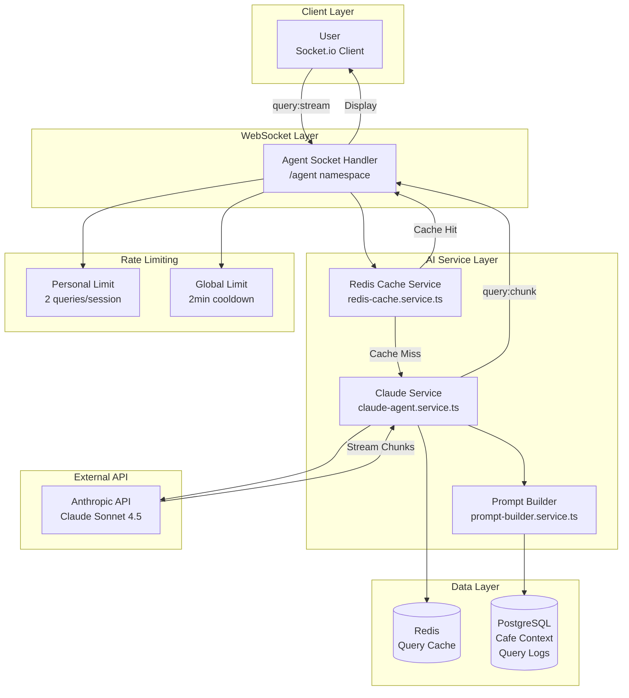

# AI Agent Integration Component

Comprehensive documentation for Component 5: Claude-powered AI agent with streaming responses and contextual awareness.

## Overview

The AI Agent Integration provides:
- **Claude Sonnet 4.5**: Latest Anthropic AI model
- **6 Personality Types**: Customizable agent personas
- **Streaming Responses**: Real-time response via Socket.io
- **Smart Caching**: Redis cache for common queries (1h TTL)
- **Context-Aware**: Cafe stats, popular drinks, peak hours
- **Rate Limited**: 2 queries/session, 2min global cooldown

## Architecture



## Key Features

### 1. Claude API Integration

**File**: `backend/src/services/claude-agent.service.ts:35`

```typescript
export async function streamAgentQuery(
  query: string,
  cafeId: string,
  personality: AgentPersonality = 'bartender',
  socket: Socket
): Promise<void> {
  try {
    socket.emit('query:start', { query });

    // 1. Build context prompt
    const systemPrompt = await buildSystemPrompt(cafeId, personality);

    // 2. Stream from Claude API
    const stream = await anthropic.messages.stream({
      model: 'claude-sonnet-4-5-20250514',
      max_tokens: 1024,
      temperature: 0.7,
      system: systemPrompt,
      messages: [
        {
          role: 'user',
          content: query
        }
      ]
    });

    let fullResponse = '';

    // 3. Stream chunks to client
    for await (const chunk of stream) {
      if (chunk.type === 'content_block_delta') {
        const text = chunk.delta.text;
        fullResponse += text;

        socket.emit('query:chunk', { text });
      }
    }

    // 4. Complete
    socket.emit('query:complete', { fullResponse });

    // 5. Cache response
    await cacheQuery(cafeId, query, fullResponse);

    // 6. Log query
    await logQuery(cafeId, query, fullResponse, Date.now() - startTime);

  } catch (error) {
    logger.error('Agent query error', { error, query, cafeId });
    socket.emit('query:error', {
      message: 'Failed to process query',
      error: error.message
    });
  }
}
```

### 2. Personality System

**File**: `backend/src/config/personalities.ts:15`

```typescript
export const AGENT_PERSONALITIES: Record<AgentPersonality, PersonalityConfig> = {
  bartender: {
    name: 'Bartender',
    tone: 'warm, attentive, professional',
    style: 'friendly and helpful, like a skilled barista',
    emoji: true,
    systemPrompt: `You are a friendly, knowledgeable cafe assistant.
      You're warm, attentive, and always ready to help customers have a great experience.
      You know the cafe well and can answer questions about drinks, atmosphere, and local recommendations.`
  },

  quirky: {
    name: 'Quirky',
    tone: 'playful, enthusiastic, creative',
    style: 'energetic with frequent emoji use',
    emoji: true,
    systemPrompt: `You are an enthusiastic, quirky cafe assistant with a playful personality! 🎉
      You love coffee culture, use lots of emojis, and have a creative way of explaining things.
      Make interactions fun and memorable while still being helpful!`
  },

  historian: {
    name: 'Historian',
    tone: 'educational, detailed, informative',
    style: 'knowledgeable storyteller with coffee facts',
    emoji: false,
    systemPrompt: `You are a coffee historian and expert.
      You love sharing fascinating facts about coffee origins, brewing methods, and cafe culture.
      Your responses are informative, educational, and rich with interesting details.`
  },

  sarcastic: {
    name: 'Sarcastic',
    tone: 'witty, dry humor, clever',
    style: 'sarcastic but still helpful',
    emoji: false,
    systemPrompt: `You are a witty cafe assistant with a dry sense of humor.
      You use light sarcasm and clever remarks, but you're still genuinely helpful.
      Never be mean - keep it playful and amusing.`
  },

  professional: {
    name: 'Professional',
    tone: 'efficient, direct, formal',
    style: 'concise and business-like',
    emoji: false,
    systemPrompt: `You are a professional, efficient cafe assistant.
      Provide clear, concise information without unnecessary small talk.
      You're helpful but get straight to the point.`
  },

  custom: {
    name: 'Custom',
    tone: 'configurable',
    style: 'user-defined',
    emoji: false,
    systemPrompt: '' // Filled by admin
  }
};
```

### 3. Context-Aware Prompts

**File**: `backend/src/services/prompt-builder.service.ts:25`

```typescript
export async function buildSystemPrompt(
  cafeId: string,
  personality: AgentPersonality
): Promise<string> {
  // 1. Get personality config
  const config = AGENT_PERSONALITIES[personality];

  // 2. Get cafe context
  const cafeContext = await getCafeContext(cafeId);

  // 3. Build comprehensive prompt
  return `${config.systemPrompt}

CAFE CONTEXT:
- Cafe Name: ${cafeContext.cafeName}
- Location: ${cafeContext.address}
- Current Time: ${new Date().toLocaleTimeString()}
- Active Users: ${cafeContext.activeUsers}

POPULAR ITEMS:
${cafeContext.popularDrinks.map(d => `- ${d.name} (${d.popularity}%)`).join('\n')}

PEAK HOURS:
${cafeContext.peakHours.map(h => `- ${h.time}: ${h.avgUsers} users`).join('\n')}

COMMUNITY INTERESTS:
${cafeContext.topInterests.map(i => `- ${i}`).join(', ')}

CONVERSATION TOPICS:
${cafeContext.trendingTopics.map(t => `- ${t}`).join(', ')}

GUIDELINES:
- Keep responses concise (2-3 sentences)
- Use the cafe context when relevant
- Be helpful and friendly
- ${config.emoji ? 'Use emojis appropriately' : 'Avoid emojis'}
- Tone: ${config.tone}
- Style: ${config.style}`;
}

async function getCafeContext(cafeId: string): Promise<CafeContext> {
  const [cafe, stats, interests, topics] = await Promise.all([
    db.query('SELECT * FROM cafes WHERE id = $1', [cafeId]),
    getCafeStats(cafeId),
    getTopInterests(cafeId),
    getTrendingTopics(cafeId)
  ]);

  return {
    cafeName: cafe.rows[0].name,
    address: cafe.rows[0].address,
    activeUsers: stats.activeUsers,
    popularDrinks: stats.popularDrinks,
    peakHours: stats.peakHours,
    topInterests: interests,
    trendingTopics: topics
  };
}
```

### 4. Smart Caching

**File**: `backend/src/services/redis-cache.service.ts:25`

```typescript
export async function checkQueryCache(
  cafeId: string,
  query: string
): Promise<string | null> {
  // 1. Generate cache key from query hash
  const queryHash = crypto
    .createHash('sha256')
    .update(query.toLowerCase().trim())
    .digest('hex')
    .substring(0, 16);

  const cacheKey = `agent:cache:${cafeId}:${queryHash}`;

  // 2. Check cache
  const cached = await redis.get(cacheKey);

  if (cached) {
    logger.info('Agent cache hit', { cafeId, queryHash });
    await redis.hincrby(`agent:analytics:${cafeId}`, 'cache_hits', 1);
    return cached;
  }

  await redis.hincrby(`agent:analytics:${cafeId}`, 'cache_misses', 1);
  return null;
}

export async function cacheQuery(
  cafeId: string,
  query: string,
  response: string,
  ttlSeconds: number = 3600
): Promise<void> {
  const queryHash = crypto
    .createHash('sha256')
    .update(query.toLowerCase().trim())
    .digest('hex')
    .substring(0, 16);

  const cacheKey = `agent:cache:${cafeId}:${queryHash}`;

  // Store with 1 hour TTL
  await redis.setex(cacheKey, ttlSeconds, response);

  logger.info('Query cached', { cafeId, queryHash, ttl: ttlSeconds });
}
```

### 5. Proactive Messages

**File**: `backend/src/scheduler/jobs/proactiveMessages.ts:35`

```typescript
export async function generateProactiveMessages(): Promise<void> {
  // 1. Get active cafes
  const cafes = await db.query(
    `SELECT DISTINCT cafe_id
     FROM users
     WHERE expires_at > NOW()
       AND created_at > NOW() - INTERVAL '2 hours'`
  );

  for (const cafe of cafes.rows) {
    try {
      // 2. Check global cooldown
      const lastMessage = await redis.get(`agent:proactive:${cafe.cafe_id}:last`);
      const cooldown = 5 * 60 * 1000; // 5 minutes

      if (lastMessage && Date.now() - parseInt(lastMessage) < cooldown) {
        continue;
      }

      // 3. Get cafe context
      const context = await getCafeContext(cafe.cafe_id);

      // 4. Generate contextual message
      const message = await anthropic.messages.create({
        model: 'claude-sonnet-4-5-20250514',
        max_tokens: 150,
        system: `Generate a short, contextual message to spark conversation in the cafe.
          Base it on: current time, active users, trending topics.
          Keep it friendly, relevant, and under 2 sentences.`,
        messages: [
          {
            role: 'user',
            content: JSON.stringify({
              time: new Date().toLocaleTimeString(),
              activeUsers: context.activeUsers,
              topics: context.trendingTopics,
              interests: context.topInterests
            })
          }
        ]
      });

      const generatedMessage = message.content[0].text;

      // 5. Broadcast to cafe
      io.to(`cafe:${cafe.cafe_id}`).emit('proactive:message', {
        message: generatedMessage,
        timestamp: new Date()
      });

      // 6. Update cooldown
      await redis.set(`agent:proactive:${cafe.cafe_id}:last`, Date.now().toString());

      logger.info('Proactive message sent', { cafeId: cafe.cafe_id });

    } catch (error) {
      logger.error('Proactive message error', { cafeId: cafe.cafe_id, error });
    }
  }
}
```

## WebSocket Events

### Client → Server

```typescript
// Connect to agent namespace
const agentSocket = io('/agent', {
  auth: { token: accessToken }
});

// Join cafe for proactive messages
agentSocket.emit('cafe:join', { cafeId });

// Send query
agentSocket.emit('query:stream', {
  query: "What's popular today?",
  cafeId: "cafe-uuid",
  personality: "bartender" // optional
});
```

### Server → Client

```typescript
// Query started
agentSocket.on('query:start', ({ query }) => {
  console.log('Query started:', query);
});

// Streaming chunk
agentSocket.on('query:chunk', ({ text }) => {
  // Append to display
  response += text;
});

// Query complete
agentSocket.on('query:complete', ({ fullResponse }) => {
  console.log('Complete response:', fullResponse);
});

// Error
agentSocket.on('query:error', ({ message, error }) => {
  console.error('Query failed:', message);
});

// Proactive message
agentSocket.on('proactive:message', ({ message, timestamp }) => {
  displayProactiveMessage(message);
});
```

## Configuration

```env
# Anthropic Configuration
ANTHROPIC_API_KEY=sk-ant-api03-your-key-here
ANTHROPIC_MODEL=claude-sonnet-4-5-20250514
AI_MAX_TOKENS=1024
AI_TEMPERATURE=0.7

# Cache Configuration
AI_CACHE_ENABLED=true
AI_CACHE_TTL=3600
AI_CACHE_MAX_SIZE=1000

# Rate Limiting
RATE_LIMIT_AGENT_PERSONAL_COUNT=2
RATE_LIMIT_AGENT_GLOBAL_COOLDOWN=120

# Proactive Messages
ENABLE_PROACTIVE_MESSAGES=true
PROACTIVE_MESSAGE_INTERVAL=120000
PROACTIVE_MESSAGE_COOLDOWN=300000
```

## Performance Metrics

| Metric | Value |
|--------|-------|
| Average Response Time | 2-4 seconds |
| Cache Hit Rate | 35-40% |
| Cost per Query | ~$0.001 |
| Streaming Latency | < 100ms first chunk |
| Concurrent Queries | Up to 100 |

## Database Schema

```sql
CREATE TABLE agent_queries (
  id UUID PRIMARY KEY DEFAULT gen_random_uuid(),
  cafe_id UUID NOT NULL REFERENCES cafes(id),
  user_id UUID REFERENCES users(id) ON DELETE SET NULL,
  query TEXT NOT NULL,
  response TEXT NOT NULL,
  personality VARCHAR(50),
  response_time_ms INT,
  cached BOOLEAN DEFAULT false,
  created_at TIMESTAMP DEFAULT NOW()
);

CREATE TABLE agent_config (
  id UUID PRIMARY KEY DEFAULT gen_random_uuid(),
  cafe_id UUID NOT NULL REFERENCES cafes(id) UNIQUE,
  personality VARCHAR(50) DEFAULT 'bartender',
  custom_prompt TEXT,
  enabled BOOLEAN DEFAULT true,
  updated_at TIMESTAMP DEFAULT NOW()
);
```

---

**Last Updated**: 2025-11-19
