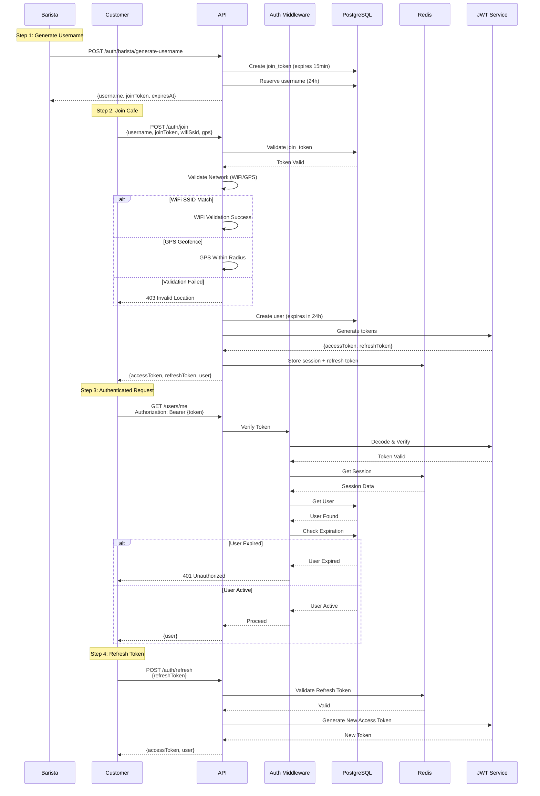

# Authentication & User Management Component

Comprehensive documentation for Component 1: Authentication, User Management, Badge System, and Network Validation.

## Table of Contents

- [Overview](#overview)
- [Architecture](#architecture)
- [Authentication Flow](#authentication-flow)
- [Badge System](#badge-system)
- [Network Validation](#network-validation)
- [Entry Points](#entry-points)
- [Key Files](#key-files)
- [API Reference](#api-reference)
- [Security Considerations](#security-considerations)
- [Database Schema](#database-schema)
- [Configuration](#configuration)

## Overview

The Authentication & User Management component handles:
- **Ephemeral User Creation**: Temporary 24-hour usernames generated by baristas
- **JWT Authentication**: Stateless token-based authentication with refresh tokens
- **Badge System**: Reward system for frequent visitors
- **Network Validation**: Physical presence verification via WiFi/GPS
- **Session Management**: Automatic expiration and cleanup

**Key Features:**
- Barista-generated temporary usernames (24h validity)
- WiFi SSID matching + GPS geofencing fallback
- JWT access tokens (24h) + refresh tokens (7d)
- Badge eligibility: 5 tips in 7 days = 30-day badge
- Automatic cleanup of expired users

## Architecture

### Component Structure

```mermaid
graph TB
    subgraph "Entry Points"
        AuthRoutes[authRoutes.ts<br/>POST /barista/generate-username<br/>POST /join<br/>POST /refresh]
        UserRoutes[userRoutes.ts<br/>GET /me<br/>PUT /interests]
        BadgeRoutes[badgeRoutes.ts<br/>POST /record-tip<br/>GET /status]
    end

    subgraph "Controllers"
        AuthController[authController.ts<br/>generateUsername()<br/>joinCafe()<br/>refreshToken()]
        UserController[userController.ts<br/>getCurrentUser()<br/>updateInterests()]
        BadgeController[badgeController.ts<br/>recordTip()<br/>getBadgeStatus()]
    end

    subgraph "Services & Models"
        User[User.ts<br/>Business Logic]
        Badge[Badge.ts<br/>Badge Eligibility]
        JoinToken[JoinToken.ts<br/>Token Management]
        NetworkValidation[networkValidation.ts<br/>WiFi/GPS Checks]
        JWT[jwt.ts<br/>Token Generation]
    end

    subgraph "Data Layer"
        PostgreSQL[(PostgreSQL<br/>users, badges,<br/>tips, join_tokens)]
        Redis[(Redis<br/>sessions,<br/>refresh_tokens)]
    end

    AuthRoutes --> AuthController
    UserRoutes --> UserController
    BadgeRoutes --> BadgeController

    AuthController --> User
    AuthController --> JoinToken
    AuthController --> NetworkValidation
    AuthController --> JWT

    UserController --> User
    BadgeController --> Badge

    User --> PostgreSQL
    Badge --> PostgreSQL
    JoinToken --> PostgreSQL
    JWT --> Redis
```

### Data Flow



## Authentication Flow

### 1. Username Generation (Barista)

**Endpoint**: `POST /api/auth/barista/generate-username`

**File**: `backend/src/controllers/authController.ts:35`

```typescript
export async function generateUsername(req: Request, res: Response): Promise<void> {
  const { cafeId, receiptId } = req.body;

  // Generate unique username
  const username = generateUniqueUsername();

  // Create join token (15min validity)
  const token = await JoinToken.create({
    cafeId,
    username,
    receiptId,
    expiresAt: new Date(Date.now() + 15 * 60 * 1000)
  });

  res.json({
    username,
    joinToken: token.token,
    expiresAt: token.expiresAt
  });
}
```

**Username Format**: `[Adjective][Noun][Number]` (e.g., "HappyOtter42")

**Implementation**: `backend/src/models/User.ts:156`

```typescript
function generateUniqueUsername(): string {
  const adjectives = ['Happy', 'Sunny', 'Bright', 'Clever', 'Swift'];
  const nouns = ['Otter', 'Panda', 'Fox', 'Bear', 'Eagle'];
  const number = Math.floor(Math.random() * 100);

  const adjective = adjectives[Math.floor(Math.random() * adjectives.length)];
  const noun = nouns[Math.floor(Math.random() * nouns.length)];

  return `${adjective}${noun}${number}`;
}
```

### 2. Join Cafe (Customer)

**Endpoint**: `POST /api/auth/join`

**File**: `backend/src/controllers/authController.ts:68`

```typescript
export async function joinCafe(req: Request, res: Response): Promise<void> {
  const { username, joinToken, cafeId, wifiSsid, latitude, longitude } = req.body;

  // 1. Validate join token
  const token = await JoinToken.validate(joinToken);
  if (!token || token.cafeId !== cafeId) {
    throw new ApiError(401, 'Invalid join token');
  }

  // 2. Validate network (WiFi or GPS)
  const cafe = await db.query('SELECT * FROM cafes WHERE id = $1', [cafeId]);
  const isValid = validateNetwork(cafe, wifiSsid, latitude, longitude);

  if (!isValid) {
    throw new ApiError(403, 'Network validation failed');
  }

  // 3. Create user (24h expiration)
  const user = await User.create({
    username,
    cafeId,
    expiresAt: new Date(Date.now() + 24 * 60 * 60 * 1000)
  });

  // 4. Generate JWT tokens
  const accessToken = generateAccessToken(user);
  const refreshToken = generateRefreshToken(user);

  // 5. Store in Redis
  await redis.set(`session:${user.id}`, JSON.stringify(user), 'EX', 86400);
  await redis.set(`user:${user.id}:refresh_token`, refreshToken, 'EX', 604800);

  // 6. Invalidate join token
  await JoinToken.invalidate(joinToken);

  res.json({ accessToken, refreshToken, user });
}
```

### 3. Token Refresh

**Endpoint**: `POST /api/auth/refresh`

**File**: `backend/src/controllers/authController.ts:125`

```typescript
export async function refreshToken(req: Request, res: Response): Promise<void> {
  const { refreshToken } = req.body;

  // 1. Decode refresh token
  const decoded = verifyRefreshToken(refreshToken);

  // 2. Validate in Redis
  const storedToken = await redis.get(`user:${decoded.userId}:refresh_token`);
  if (storedToken !== refreshToken) {
    throw new ApiError(401, 'Invalid refresh token');
  }

  // 3. Get user
  const user = await User.findById(decoded.userId);
  if (!user || user.isExpired()) {
    throw new ApiError(401, 'User expired');
  }

  // 4. Generate new access token
  const newAccessToken = generateAccessToken(user);

  res.json({ accessToken: newAccessToken, user });
}
```

### 4. Authentication Middleware

**File**: `backend/src/middleware/auth.ts:15`

```typescript
export async function authenticateJWT(
  req: Request,
  res: Response,
  next: NextFunction
): Promise<void> {
  try {
    // 1. Extract token from header
    const authHeader = req.headers.authorization;
    if (!authHeader || !authHeader.startsWith('Bearer ')) {
      throw new ApiError(401, 'No token provided');
    }

    const token = authHeader.substring(7);

    // 2. Verify token
    const decoded = verifyAccessToken(token);

    // 3. Get user from Redis (fast) or DB (fallback)
    let user = await redis.get(`session:${decoded.userId}`);
    if (!user) {
      user = await User.findById(decoded.userId);
      if (user) {
        await redis.set(`session:${decoded.userId}`, JSON.stringify(user), 'EX', 86400);
      }
    }

    if (!user) {
      throw new ApiError(401, 'User not found');
    }

    // 4. Check expiration
    if (new Date(user.expiresAt) < new Date()) {
      throw new ApiError(401, 'User session expired');
    }

    // 5. Attach to request
    req.user = user;
    next();
  } catch (error) {
    next(error);
  }
}
```

## Badge System

### Badge Eligibility

**Criteria**: 5 tips within 7 days = 30-day badge

**File**: `backend/src/models/Badge.ts:45`

```typescript
export async function checkBadgeEligibility(userId: string) {
  const sevenDaysAgo = new Date(Date.now() - 7 * 24 * 60 * 60 * 1000);

  // Count tips in last 7 days
  const result = await db.query(
    `SELECT COUNT(*) as tip_count
     FROM tips
     WHERE user_id = $1 AND created_at >= $2`,
    [userId, sevenDaysAgo]
  );

  const tipCount = parseInt(result.rows[0].tip_count);
  const eligible = tipCount >= 5;

  return {
    eligible,
    tipsInWindow: tipCount,
    tipsNeeded: Math.max(0, 5 - tipCount),
    tipThreshold: 5,
    windowDays: 7
  };
}
```

### Record Tip

**Endpoint**: `POST /api/badges/record-tip`

**File**: `backend/src/controllers/badgeController.ts:25`

```typescript
export async function recordTip(req: Request, res: Response): Promise<void> {
  const { userId, amount } = req.body;

  // 1. Record tip
  const tip = await db.query(
    `INSERT INTO tips (user_id, amount, created_at)
     VALUES ($1, $2, NOW())
     RETURNING *`,
    [userId, amount]
  );

  // 2. Check eligibility
  const eligibility = await checkBadgeEligibility(userId);

  // 3. Award badge if eligible
  let badge = null;
  if (eligibility.eligible) {
    const existingBadge = await db.query(
      'SELECT * FROM badges WHERE user_id = $1 AND badge_type = $2',
      [userId, 'regular']
    );

    if (existingBadge.rows.length === 0) {
      // Create new badge
      const expiresAt = new Date(Date.now() + 30 * 24 * 60 * 60 * 1000);
      badge = await db.query(
        `INSERT INTO badges (user_id, badge_type, awarded_at, expires_at)
         VALUES ($1, $2, NOW(), $3)
         RETURNING *`,
        [userId, 'regular', expiresAt]
      );

      // Update user badge_status
      await db.query(
        `UPDATE users SET badge_status = 'active' WHERE id = $1`,
        [userId]
      );
    }
  }

  res.json({ tip: tip.rows[0], eligibility, badge: badge?.rows[0] });
}
```

### Badge Perks

**Implementation**: `backend/src/models/Badge.ts:85`

```typescript
export function getBadgePerks(badgeStatus: string): string[] {
  if (badgeStatus === 'active') {
    return [
      'Priority in chat',
      'Extended session duration',
      'Reduced rate limits (60 msgs/hour vs 30)',
      'Faster message cooldown (15s vs 30s)',
      'Special badge icon',
      'Access to exclusive features'
    ];
  }
  return [];
}
```

## Network Validation

### WiFi Validation (Primary)

**File**: `backend/src/utils/networkValidation.ts:15`

```typescript
export function validateWiFiSSID(
  cafeSSID: string,
  userSSID: string
): boolean {
  if (!cafeSSID || !userSSID) return false;

  // Normalize SSIDs (case-insensitive, trim whitespace)
  const normalizedCafe = cafeSSID.toLowerCase().trim();
  const normalizedUser = userSSID.toLowerCase().trim();

  // Exact match or partial match (for networks with suffixes like -5G)
  return normalizedUser === normalizedCafe ||
         normalizedUser.startsWith(normalizedCafe) ||
         normalizedCafe.startsWith(normalizedUser);
}
```

### GPS Validation (Fallback)

**File**: `backend/src/utils/networkValidation.ts:35`

```typescript
export function validateGPS(
  cafeLatitude: number,
  cafeLongitude: number,
  userLatitude: number,
  userLongitude: number,
  radiusMeters: number = 100
): boolean {
  // Haversine formula for distance calculation
  const R = 6371e3; // Earth radius in meters
  const φ1 = (cafeLatitude * Math.PI) / 180;
  const φ2 = (userLatitude * Math.PI) / 180;
  const Δφ = ((userLatitude - cafeLatitude) * Math.PI) / 180;
  const Δλ = ((userLongitude - cafeLongitude) * Math.PI) / 180;

  const a =
    Math.sin(Δφ / 2) * Math.sin(Δφ / 2) +
    Math.cos(φ1) * Math.cos(φ2) * Math.sin(Δλ / 2) * Math.sin(Δλ / 2);

  const c = 2 * Math.atan2(Math.sqrt(a), Math.sqrt(1 - a));
  const distance = R * c;

  return distance <= radiusMeters;
}
```

### Combined Validation

**File**: `backend/src/utils/networkValidation.ts:65`

```typescript
export function validateNetwork(
  cafe: Cafe,
  wifiSsid?: string,
  latitude?: number,
  longitude?: number
): boolean {
  // Priority 1: WiFi SSID validation (most reliable)
  if (wifiSsid && cafe.wifiSsid) {
    if (validateWiFiSSID(cafe.wifiSsid, wifiSsid)) {
      logger.info('Network validated via WiFi', { cafe: cafe.id, ssid: wifiSsid });
      return true;
    }
  }

  // Priority 2: GPS validation (fallback)
  if (latitude && longitude && cafe.latitude && cafe.longitude) {
    const radiusMeters = cafe.radiusMeters || 100; // Default 100m
    if (validateGPS(cafe.latitude, cafe.longitude, latitude, longitude, radiusMeters)) {
      logger.info('Network validated via GPS', { cafe: cafe.id, distance: 'within radius' });
      return true;
    }
  }

  logger.warn('Network validation failed', { cafe: cafe.id, wifiSsid, latitude, longitude });
  return false;
}
```

## Entry Points

### 1. Main Entry Point

**File**: `backend/src/index.ts:25`

Server initialization with authentication setup.

### 2. Authentication Routes

**File**: `backend/src/routes/authRoutes.ts`

```typescript
import express from 'express';
import * as authController from '../controllers/authController';

const router = express.Router();

// Barista endpoints (no auth required)
router.post('/barista/generate-username', authController.generateUsername);

// Customer endpoints (no auth required)
router.post('/join', authController.joinCafe);
router.post('/refresh', authController.refreshToken);

export default router;
```

### 3. User Routes (Protected)

**File**: `backend/src/routes/userRoutes.ts`

```typescript
import express from 'express';
import { authenticateJWT } from '../middleware/auth';
import * as userController from '../controllers/userController';

const router = express.Router();

// All user routes require authentication
router.use(authenticateJWT);

router.get('/me', userController.getCurrentUser);
router.put('/me/interests', userController.updateInterests);
router.put('/me/poke-enabled', userController.togglePokeEnabled);

export default router;
```

### 4. Badge Routes (Protected)

**File**: `backend/src/routes/badgeRoutes.ts`

```typescript
import express from 'express';
import { authenticateJWT } from '../middleware/auth';
import * as badgeController from '../controllers/badgeController';

const router = express.Router();

// Badge recording (barista authenticated)
router.post('/record-tip', badgeController.recordTip);

// Badge status (user authenticated)
router.get('/status', authenticateJWT, badgeController.getBadgeStatus);

export default router;
```

## Key Files

| File | Purpose | Lines of Code |
|------|---------|---------------|
| `backend/src/controllers/authController.ts` | Authentication request handlers | ~180 |
| `backend/src/controllers/userController.ts` | User management handlers | ~95 |
| `backend/src/controllers/badgeController.ts` | Badge system handlers | ~120 |
| `backend/src/models/User.ts` | User business logic | ~245 |
| `backend/src/models/Badge.ts` | Badge eligibility logic | ~156 |
| `backend/src/models/JoinToken.ts` | Token management | ~88 |
| `backend/src/middleware/auth.ts` | JWT authentication middleware | ~65 |
| `backend/src/utils/jwt.ts` | JWT generation/verification | ~125 |
| `backend/src/utils/networkValidation.ts` | WiFi/GPS validation | ~98 |
| `backend/src/routes/authRoutes.ts` | Auth API routes | ~25 |
| `backend/src/routes/userRoutes.ts` | User API routes | ~18 |
| `backend/src/routes/badgeRoutes.ts` | Badge API routes | ~15 |

## API Reference

### Generate Username (Barista)

```http
POST /api/auth/barista/generate-username
Content-Type: application/json

{
  "cafeId": "cafe-uuid",
  "receiptId": "receipt-12345"
}

Response 200:
{
  "username": "HappyOtter42",
  "joinToken": "token-string",
  "expiresAt": "2025-11-19T10:15:00.000Z"
}
```

### Join Cafe (Customer)

```http
POST /api/auth/join
Content-Type: application/json

{
  "username": "HappyOtter42",
  "joinToken": "token-string",
  "cafeId": "cafe-uuid",
  "wifiSsid": "CafeWiFi-Guest",  // Optional
  "latitude": 37.7749,            // Optional
  "longitude": -122.4194          // Optional
}

Response 200:
{
  "accessToken": "eyJhbGciOiJIUzI1NiIs...",
  "refreshToken": "eyJhbGciOiJIUzI1NiIs...",
  "user": {
    "id": "user-uuid",
    "username": "HappyOtter42",
    "cafeId": "cafe-uuid",
    "badgeStatus": "none",
    "createdAt": "2025-11-19T09:00:00.000Z",
    "expiresAt": "2025-11-20T09:00:00.000Z"
  }
}

Errors:
- 401: Invalid join token
- 403: Network validation failed
- 404: Cafe not found
```

### Refresh Token

```http
POST /api/auth/refresh
Content-Type: application/json

{
  "refreshToken": "eyJhbGciOiJIUzI1NiIs..."
}

Response 200:
{
  "accessToken": "new-jwt-token",
  "user": { ... }
}

Errors:
- 401: Invalid or expired refresh token
```

### Get Current User

```http
GET /api/users/me
Authorization: Bearer {accessToken}

Response 200:
{
  "user": {
    "id": "user-uuid",
    "username": "HappyOtter42",
    "cafeId": "cafe-uuid",
    "badgeStatus": "active",
    "interests": ["coffee", "tech"],
    "pokeEnabled": true,
    "createdAt": "2025-11-19T09:00:00.000Z",
    "expiresAt": "2025-11-20T09:00:00.000Z"
  }
}
```

### Record Tip

```http
POST /api/badges/record-tip
Content-Type: application/json

{
  "userId": "user-uuid",
  "amount": 5.00
}

Response 200:
{
  "tip": {
    "id": "tip-uuid",
    "userId": "user-uuid",
    "amount": 5.00,
    "createdAt": "2025-11-19T10:00:00.000Z"
  },
  "eligibility": {
    "eligible": true,
    "tipsInWindow": 5,
    "tipsNeeded": 0,
    "tipThreshold": 5,
    "windowDays": 7
  },
  "badge": {
    "id": "badge-uuid",
    "userId": "user-uuid",
    "badgeType": "regular",
    "awardedAt": "2025-11-19T10:00:00.000Z",
    "expiresAt": "2025-12-19T10:00:00.000Z"
  }
}
```

### Get Badge Status

```http
GET /api/badges/status
Authorization: Bearer {accessToken}

Response 200:
{
  "hasBadge": true,
  "badgeStatus": "active",
  "eligibility": {
    "tipsInWindow": 7,
    "tipsNeeded": 0,
    "tipThreshold": 5,
    "windowDays": 7
  },
  "perks": [
    "Priority in chat",
    "Extended session duration",
    "Reduced rate limits (60 msgs/hour vs 30)",
    "Faster message cooldown (15s vs 30s)",
    "Special badge icon"
  ]
}
```

## Security Considerations

### JWT Token Security

1. **Strong Secrets**: Use 64+ character random secrets
2. **Short Expiration**: Access tokens expire in 24h
3. **Token Rotation**: Refresh tokens expire in 7d
4. **Signature Verification**: All tokens verified on each request

### Password Security

- No passwords stored (ephemeral usernames only)
- Join tokens expire in 15 minutes
- One-time use tokens (invalidated after join)

### Network Validation Security

- WiFi SSID cannot be spoofed easily (requires physical presence)
- GPS validation requires location permissions
- Combined validation provides strong location proof

### Session Security

- Sessions stored in Redis with automatic expiration
- Session invalidation on user expiration
- Refresh tokens revoked on logout

## Database Schema

### users Table

```sql
CREATE TABLE users (
  id UUID PRIMARY KEY DEFAULT gen_random_uuid(),
  username VARCHAR(50) UNIQUE NOT NULL,
  cafe_id UUID NOT NULL REFERENCES cafes(id),
  badge_status VARCHAR(20) DEFAULT 'none',
  poke_enabled BOOLEAN DEFAULT true,
  created_at TIMESTAMP DEFAULT NOW(),
  expires_at TIMESTAMP NOT NULL,
  CONSTRAINT check_expires_at CHECK (expires_at > created_at)
);

CREATE INDEX idx_users_cafe ON users(cafe_id);
CREATE INDEX idx_users_expires ON users(expires_at);
```

### badges Table

```sql
CREATE TABLE badges (
  id UUID PRIMARY KEY DEFAULT gen_random_uuid(),
  user_id UUID NOT NULL REFERENCES users(id) ON DELETE CASCADE,
  badge_type VARCHAR(50) NOT NULL,
  awarded_at TIMESTAMP DEFAULT NOW(),
  expires_at TIMESTAMP,
  UNIQUE(user_id, badge_type)
);

CREATE INDEX idx_badges_user ON badges(user_id);
CREATE INDEX idx_badges_expires ON badges(expires_at);
```

### tips Table

```sql
CREATE TABLE tips (
  id UUID PRIMARY KEY DEFAULT gen_random_uuid(),
  user_id UUID NOT NULL REFERENCES users(id) ON DELETE CASCADE,
  amount DECIMAL(10, 2) NOT NULL,
  created_at TIMESTAMP DEFAULT NOW()
);

CREATE INDEX idx_tips_user_created ON tips(user_id, created_at);
```

### join_tokens Table

```sql
CREATE TABLE join_tokens (
  id UUID PRIMARY KEY DEFAULT gen_random_uuid(),
  token VARCHAR(255) UNIQUE NOT NULL,
  username VARCHAR(50) NOT NULL,
  cafe_id UUID NOT NULL REFERENCES cafes(id),
  receipt_id VARCHAR(100),
  used BOOLEAN DEFAULT false,
  created_at TIMESTAMP DEFAULT NOW(),
  expires_at TIMESTAMP NOT NULL
);

CREATE INDEX idx_join_tokens_token ON join_tokens(token);
CREATE INDEX idx_join_tokens_expires ON join_tokens(expires_at);
```

### refresh_tokens Table

```sql
CREATE TABLE refresh_tokens (
  id UUID PRIMARY KEY DEFAULT gen_random_uuid(),
  user_id UUID NOT NULL REFERENCES users(id) ON DELETE CASCADE,
  token TEXT NOT NULL,
  expires_at TIMESTAMP NOT NULL,
  created_at TIMESTAMP DEFAULT NOW(),
  revoked BOOLEAN DEFAULT false
);

CREATE INDEX idx_refresh_tokens_user ON refresh_tokens(user_id);
CREATE INDEX idx_refresh_tokens_token ON refresh_tokens(token);
```

## Configuration

### Environment Variables

```env
# JWT Configuration
JWT_SECRET=your-super-secret-jwt-key-change-this
JWT_EXPIRES_IN=24h
REFRESH_TOKEN_SECRET=your-refresh-token-secret
REFRESH_TOKEN_EXPIRES_IN=7d

# Badge Configuration
BADGE_TIP_THRESHOLD=5
BADGE_TIP_WINDOW_DAYS=7
BADGE_DURATION_DAYS=30

# User Configuration
USER_SESSION_DURATION_HOURS=24
USER_CLEANUP_INTERVAL_HOURS=1

# Location Validation
LOCATION_VALIDATION_RADIUS=100
WIFI_VALIDATION_ENABLED=true
GPS_VALIDATION_ENABLED=true
```

### Tuning Parameters

| Parameter | Default | Description |
|-----------|---------|-------------|
| `JWT_EXPIRES_IN` | 24h | Access token lifetime |
| `REFRESH_TOKEN_EXPIRES_IN` | 7d | Refresh token lifetime |
| `BADGE_TIP_THRESHOLD` | 5 | Tips needed for badge |
| `BADGE_TIP_WINDOW_DAYS` | 7 | Window for tip counting |
| `BADGE_DURATION_DAYS` | 30 | Badge validity period |
| `USER_SESSION_DURATION_HOURS` | 24 | User session lifetime |
| `LOCATION_VALIDATION_RADIUS` | 100m | GPS geofence radius |

---

## Related Documentation

- [Chat System Component](./CHAT_SYSTEM.md)
- [Rate Limiting Component](./RATE_LIMITING.md)
- [Architecture Overview](../ARCHITECTURE_OVERVIEW.md)
- [API Examples](../../backend/API_EXAMPLES.md)

---

**Last Updated**: 2025-11-19
