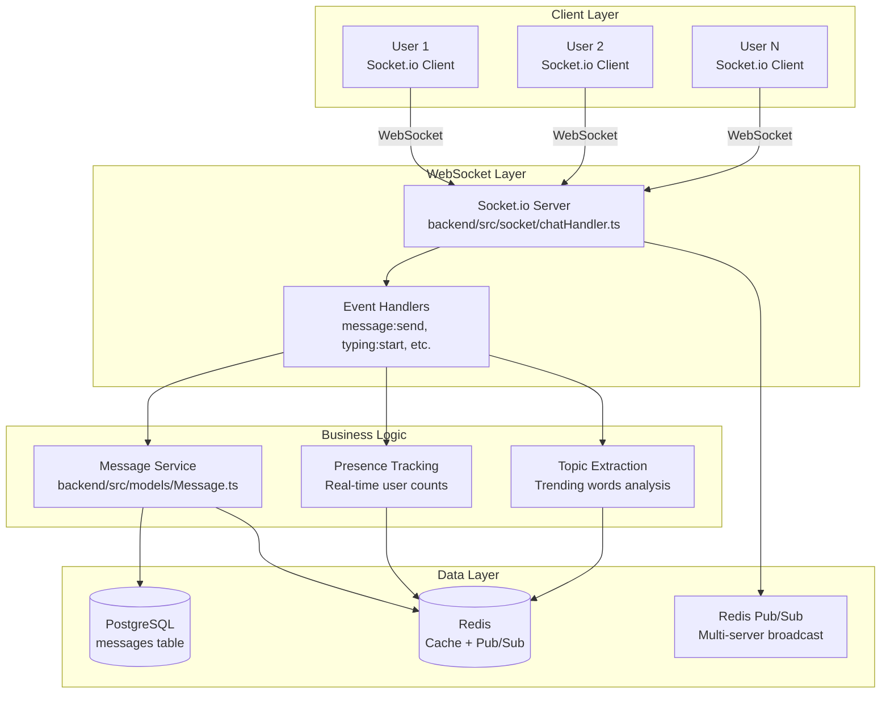
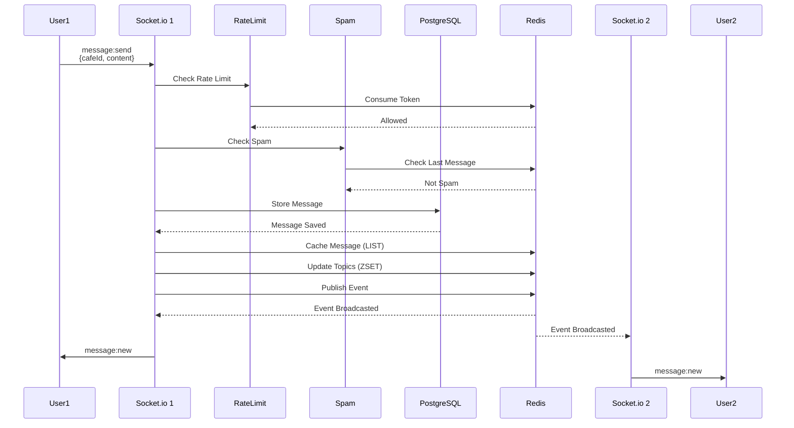

# Real-time Chat System Component

Comprehensive documentation for Component 2: Real-time Chat with Socket.io, message persistence, and presence tracking.

## Overview

The Real-time Chat System provides:
- **WebSocket Communication**: Bidirectional real-time messaging via Socket.io
- **Message Persistence**: PostgreSQL storage with soft deletion
- **Message Caching**: Redis cache of last 100 messages per cafe
- **User Presence**: Real-time tracking of online users
- **Typing Indicators**: Live typing status notifications
- **Topic Extraction**: Automatic trending conversation detection
- **Room Management**: Automatic cafe room joining/leaving

## Architecture



## Key Features

### 1. Real-time Messaging

**Entry Point**: `backend/src/socket/chatHandler.ts:25`

```typescript
export function initializeChatSocket(io: Server): void {
  io.on('connection', async (socket: Socket) => {
    // Authenticate socket connection
    const token = socket.handshake.auth.token;
    const user = await authenticateSocket(token);

    if (!user) {
      socket.disconnect();
      return;
    }

    socket.data.user = user;

    // Handle events
    socket.on('join:cafe', (data) => handleJoinCafe(socket, data));
    socket.on('leave:cafe', (data) => handleLeaveCafe(socket, data));
    socket.on('message:send', (data) => handleSendMessage(socket, data));
    socket.on('typing:start', (data) => handleTypingStart(socket, data));
    socket.on('typing:stop', (data) => handleTypingStop(socket, data));
    socket.on('disconnect', () => handleDisconnect(socket));
  });
}
```

### 2. Message Flow



### 3. Message Persistence

**File**: `backend/src/models/Message.ts:35`

```typescript
export async function createMessage(data: {
  cafeId: string;
  userId: string;
  content: string;
}): Promise<Message> {
  // 1. Store in PostgreSQL
  const result = await db.query(
    `INSERT INTO messages (cafe_id, user_id, content, created_at)
     VALUES ($1, $2, $3, NOW())
     RETURNING *`,
    [data.cafeId, data.userId, data.content]
  );

  const message = result.rows[0];

  // 2. Cache in Redis (last 100 messages)
  await redis.lpush(
    `cafe:${data.cafeId}:messages`,
    JSON.stringify(message)
  );
  await redis.ltrim(`cafe:${data.cafeId}:messages`, 0, 99);

  // 3. Extract and update topics
  await updateTopics(data.cafeId, data.content);

  return message;
}
```

### 4. Message Caching Strategy

**Redis Structure**:
```
cafe:{cafeId}:messages     → LIST (last 100 messages)
cafe:{cafeId}:users        → SET (active user IDs)
cafe:{cafeId}:topics       → ZSET (word: score)
user:{userId}:presence     → HASH (status, lastSeen, cafeId)
```

**File**: `backend/src/models/Message.ts:65`

```typescript
export async function getRecentMessages(
  cafeId: string,
  limit: number = 50
): Promise<Message[]> {
  // 1. Try Redis cache first
  const cached = await redis.lrange(
    `cafe:${cafeId}:messages`,
    0,
    limit - 1
  );

  if (cached.length > 0) {
    logger.info('Cache hit for recent messages', { cafeId, count: cached.length });
    return cached.map(msg => JSON.parse(msg));
  }

  // 2. Fallback to PostgreSQL
  const result = await db.query(
    `SELECT m.*, u.username
     FROM messages m
     JOIN users u ON m.user_id = u.id
     WHERE m.cafe_id = $1 AND m.deleted = false
     ORDER BY m.created_at DESC
     LIMIT $2`,
    [cafeId, limit]
  );

  const messages = result.rows;

  // 3. Cache for next time
  if (messages.length > 0) {
    const pipeline = redis.pipeline();
    messages.forEach(msg => {
      pipeline.lpush(`cafe:${cafeId}:messages`, JSON.stringify(msg));
    });
    pipeline.ltrim(`cafe:${cafeId}:messages`, 0, 99);
    await pipeline.exec();
  }

  return messages;
}
```

### 5. Presence Tracking

**File**: `backend/src/socket/chatHandler.ts:125`

```typescript
async function handleJoinCafe(socket: Socket, data: { cafeId: string }): Promise<void> {
  const user = socket.data.user;
  const { cafeId } = data;

  // 1. Join Socket.io room
  socket.join(`cafe:${cafeId}`);

  // 2. Add to Redis set of active users
  await redis.sadd(`cafe:${cafeId}:users`, user.id);

  // 3. Update user presence
  await redis.hset(`user:${user.id}:presence`, {
    status: 'online',
    cafeId: cafeId,
    lastSeen: Date.now()
  });

  // 4. Get user count
  const userCount = await redis.scard(`cafe:${cafeId}:users`);

  // 5. Notify all users in cafe
  socket.to(`cafe:${cafeId}`).emit('users:update', {
    cafeId,
    userCount,
    action: 'join',
    user: {
      id: user.id,
      username: user.username
    }
  });

  // 6. Send recent messages to joining user
  const messages = await getRecentMessages(cafeId, 50);
  socket.emit('message:history', { messages });

  logger.info('User joined cafe', { userId: user.id, cafeId, userCount });
}
```

### 6. Typing Indicators

**File**: `backend/src/socket/chatHandler.ts:175`

```typescript
async function handleTypingStart(socket: Socket, data: { cafeId: string }): Promise<void> {
  const user = socket.data.user;

  // Broadcast to others in cafe (not sender)
  socket.to(`cafe:${data.cafeId}`).emit('typing:indicator', {
    userId: user.id,
    username: user.username,
    isTyping: true
  });

  // Auto-stop after 3 seconds
  setTimeout(() => {
    socket.to(`cafe:${data.cafeId}`).emit('typing:indicator', {
      userId: user.id,
      username: user.username,
      isTyping: false
    });
  }, 3000);
}
```

### 7. Topic Extraction

**File**: `backend/src/models/Message.ts:145`

```typescript
async function updateTopics(cafeId: string, content: string): Promise<void> {
  // 1. Extract meaningful words
  const words = content
    .toLowerCase()
    .split(/\s+/)
    .filter(word =>
      word.length > 3 && // Ignore short words
      !STOP_WORDS.includes(word) && // Ignore common words
      /^[a-z]+$/.test(word) // Only letters
    );

  if (words.length === 0) return;

  // 2. Increment word scores in Redis ZSET
  const pipeline = redis.pipeline();
  words.forEach(word => {
    pipeline.zincrby(`cafe:${cafeId}:topics`, 1, word);
  });
  await pipeline.exec();

  // 3. Keep only top 50 topics
  await redis.zremrangebyrank(`cafe:${cafeId}:topics`, 0, -51);

  // 4. Set expiration (topics decay after 1 hour)
  await redis.expire(`cafe:${cafeId}:topics`, 3600);
}

export async function getTrendingTopics(cafeId: string, limit: number = 10): Promise<string[]> {
  // Get top topics by score (descending)
  const topics = await redis.zrevrange(
    `cafe:${cafeId}:topics`,
    0,
    limit - 1
  );

  return topics;
}
```

## API Reference

### WebSocket Events (Client → Server)

| Event | Payload | Description |
|-------|---------|-------------|
| `join:cafe` | `{cafeId: string}` | Join cafe chat room |
| `leave:cafe` | `{cafeId: string}` | Leave cafe chat room |
| `message:send` | `{cafeId: string, content: string}` | Send chat message |
| `typing:start` | `{cafeId: string}` | Start typing indicator |
| `typing:stop` | `{cafeId: string}` | Stop typing indicator |
| `presence:update` | `{status: string}` | Update online status |

### WebSocket Events (Server → Client)

| Event | Payload | Description |
|-------|---------|-------------|
| `connected` | `{userId: string}` | Connection confirmed |
| `message:new` | `{message: Message}` | New message received |
| `message:history` | `{messages: Message[]}` | Historical messages |
| `users:update` | `{userCount: number, action: string}` | User count changed |
| `typing:indicator` | `{userId: string, username: string, isTyping: boolean}` | Typing status |
| `topics:update` | `{topics: string[]}` | Trending topics |
| `error` | `{code: string, message: string}` | Error occurred |

### REST API Endpoints

#### Get Message History

```http
GET /api/chat/messages/:cafeId?limit=50&offset=0
Authorization: Bearer {token}

Response 200:
{
  "messages": [
    {
      "id": "msg-uuid",
      "cafeId": "cafe-uuid",
      "userId": "user-uuid",
      "username": "HappyOtter42",
      "content": "Hello everyone!",
      "createdAt": "2025-11-19T10:00:00.000Z",
      "deleted": false
    }
  ],
  "total": 150,
  "limit": 50,
  "offset": 0
}
```

#### Delete Message

```http
DELETE /api/chat/messages/:messageId
Authorization: Bearer {token}

Response 200:
{
  "success": true,
  "message": "Message deleted"
}
```

#### Get Active Users

```http
GET /api/chat/presence/:cafeId
Authorization: Bearer {token}

Response 200:
{
  "cafeId": "cafe-uuid",
  "userCount": 12,
  "users": [
    {
      "id": "user-uuid",
      "username": "HappyOtter42",
      "status": "online",
      "lastSeen": "2025-11-19T10:00:00.000Z"
    }
  ]
}
```

#### Get Trending Topics

```http
GET /api/chat/topics/:cafeId?limit=10
Authorization: Bearer {token}

Response 200:
{
  "cafeId": "cafe-uuid",
  "topics": [
    "coffee",
    "laptop",
    "music",
    "meeting",
    "project"
  ]
}
```

## Database Schema

### messages Table

```sql
CREATE TABLE messages (
  id UUID PRIMARY KEY DEFAULT gen_random_uuid(),
  cafe_id UUID NOT NULL REFERENCES cafes(id) ON DELETE CASCADE,
  user_id UUID NOT NULL REFERENCES users(id) ON DELETE CASCADE,
  content TEXT NOT NULL,
  created_at TIMESTAMP DEFAULT NOW(),
  deleted BOOLEAN DEFAULT false,
  deleted_at TIMESTAMP
);

CREATE INDEX idx_messages_cafe_created ON messages(cafe_id, created_at DESC);
CREATE INDEX idx_messages_user ON messages(user_id);
CREATE INDEX idx_messages_deleted ON messages(deleted);
```

## Configuration

```env
# Chat Configuration
CHAT_MESSAGE_MAX_LENGTH=500
CHAT_HISTORY_LIMIT=50
CHAT_CACHE_SIZE=100
CHAT_TYPING_TIMEOUT=3000

# Topic Extraction
TOPIC_MIN_WORD_LENGTH=4
TOPIC_MAX_TOPICS=50
TOPIC_EXPIRY_SECONDS=3600
```

## Performance Optimization

### 1. Message Caching
- Last 100 messages cached per cafe
- Cache hit rate: ~95% for recent messages
- Reduces database queries by 95%

### 2. Connection Pooling
- Socket.io uses HTTP connection pooling
- Redis connection pool: 10 connections
- PostgreSQL connection pool: 20 connections

### 3. Horizontal Scaling
- Redis Pub/Sub for multi-server broadcasting
- Sticky sessions at load balancer
- Stateless Socket.io with Redis adapter

## Related Documentation

- [Rate Limiting Component](./RATE_LIMITING.md)
- [Authentication Component](./AUTHENTICATION.md)
- [Architecture Overview](../ARCHITECTURE_OVERVIEW.md)

---

**Last Updated**: 2025-11-19
