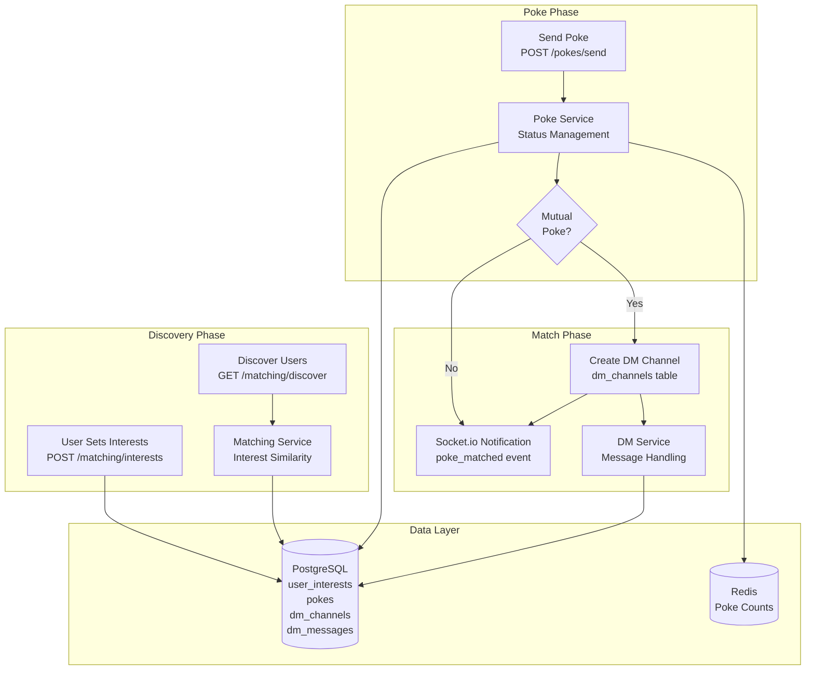

# Interest Matching & Poke System Component

Comprehensive documentation for Component 4: Interest-based matching, privacy-first poke system, and direct messaging.

## Overview

The Interest Matching & Poke System provides:
- **Interest-Based Discovery**: Find users with shared interests
- **Privacy-First Pokes**: Anonymous until mutual match
- **Automatic DM Channels**: Created on mutual poke
- **Rate-Limited**: Prevent spam and abuse
- **Auto-Expiration**: Pokes expire after 24 hours

## Architecture



## Key Features

### 1. Interest Management

**File**: `backend/src/services/matching.service.ts:25`

```typescript
export async function setUserInterests(
  userId: string,
  interests: string[]
): Promise<void> {
  const client = await db.getClient();

  try {
    await client.query('BEGIN');

    // Delete existing interests
    await client.query(
      'DELETE FROM user_interests WHERE user_id = $1',
      [userId]
    );

    // Insert new interests
    if (interests.length > 0) {
      const values = interests.map((interest, i) =>
        `($1, $${i + 2})`
      ).join(', ');

      await client.query(
        `INSERT INTO user_interests (user_id, interest)
         VALUES ${values}`,
        [userId, ...interests]
      );
    }

    await client.query('COMMIT');
    logger.info('Interests updated', { userId, count: interests.length });
  } catch (error) {
    await client.query('ROLLBACK');
    throw error;
  } finally {
    client.release();
  }
}
```

### 2. Interest-Based Discovery

**File**: `backend/src/services/matching.service.ts:75`

```typescript
export async function discoverUsers(
  userId: string,
  cafeId: string,
  interests: string[],
  limit: number = 20
): Promise<MatchedUser[]> {
  const query = `
    WITH user_shared_interests AS (
      SELECT
        u.id,
        u.username,
        ui.interest,
        COUNT(*) OVER (PARTITION BY u.id) as shared_count
      FROM users u
      JOIN user_interests ui ON u.id = ui.user_id
      WHERE u.cafe_id = $1
        AND u.id != $2
        AND u.poke_enabled = true
        AND ui.interest = ANY($3::text[])
        AND u.expires_at > NOW()
    )
    SELECT DISTINCT
      id as "userId",
      username,
      shared_count as "totalSharedInterests",
      array_agg(interest) as "sharedInterests"
    FROM user_shared_interests
    GROUP BY id, username, shared_count
    ORDER BY shared_count DESC, username
    LIMIT $4
  `;

  const result = await db.query(query, [cafeId, userId, interests, limit]);
  return result.rows;
}
```

### 3. Poke System

**File**: `backend/src/services/poke.service.ts:35`

```typescript
export async function sendPoke(
  fromUserId: string,
  toUserId: string,
  sharedInterest: string
): Promise<PokeResult> {
  // 1. Validate recipient exists and has pokes enabled
  const toUser = await db.query(
    'SELECT * FROM users WHERE id = $1 AND poke_enabled = true',
    [toUserId]
  );

  if (toUser.rows.length === 0) {
    throw new ApiError(404, 'User not found or has pokes disabled');
  }

  // 2. Check for existing poke
  const existing = await db.query(
    `SELECT * FROM pokes
     WHERE from_user_id = $1 AND to_user_id = $2
       AND status = 'pending' AND expires_at > NOW()`,
    [fromUserId, toUserId]
  );

  if (existing.rows.length > 0) {
    throw new ApiError(409, 'Poke already sent');
  }

  // 3. Check for mutual poke (reverse direction)
  const mutualPoke = await db.query(
    `SELECT * FROM pokes
     WHERE from_user_id = $1 AND to_user_id = $2
       AND status = 'pending' AND expires_at > NOW()`,
    [toUserId, fromUserId]
  );

  const isMutual = mutualPoke.rows.length > 0;

  // 4. Create poke
  const expiresAt = new Date(Date.now() + 24 * 60 * 60 * 1000); // 24h
  const poke = await db.query(
    `INSERT INTO pokes (from_user_id, to_user_id, shared_interest, status, expires_at)
     VALUES ($1, $2, $3, $4, $5)
     RETURNING *`,
    [fromUserId, toUserId, sharedInterest, isMutual ? 'matched' : 'pending', expiresAt]
  );

  // 5. If mutual, create DM channel
  let channelId = null;
  if (isMutual) {
    // Update mutual poke status
    await db.query(
      `UPDATE pokes SET status = 'matched' WHERE id = $1`,
      [mutualPoke.rows[0].id]
    );

    // Create DM channel
    const channel = await db.query(
      `INSERT INTO dm_channels (user1_id, user2_id)
       VALUES ($1, $2)
       RETURNING *`,
      [fromUserId, toUserId]
    );

    channelId = channel.rows[0].id;

    // Notify both users
    await notifyPokeMatched(fromUserId, toUserId, channelId);
  } else {
    // Notify recipient (identity hidden)
    await notifyPokeReceived(toUserId, sharedInterest);
  }

  return {
    poke: poke.rows[0],
    matched: isMutual,
    channelId
  };
}
```

### 4. Direct Messaging

**File**: `backend/src/services/dm.service.ts:35`

```typescript
export async function sendDirectMessage(
  channelId: string,
  senderId: string,
  content: string
): Promise<DMMessage> {
  // 1. Verify user is in channel
  const channel = await db.query(
    `SELECT * FROM dm_channels
     WHERE id = $1 AND (user1_id = $2 OR user2_id = $2)`,
    [channelId, senderId]
  );

  if (channel.rows.length === 0) {
    throw new ApiError(403, 'Access denied to this channel');
  }

  // 2. Insert message
  const message = await db.query(
    `INSERT INTO dm_messages (channel_id, sender_id, content)
     VALUES ($1, $2, $3)
     RETURNING *`,
    [channelId, senderId, content]
  );

  // 3. Update channel last_message_at
  await db.query(
    `UPDATE dm_channels SET last_message_at = NOW() WHERE id = $1`,
    [channelId]
  );

  // 4. Notify recipient via Socket.io
  const recipientId = channel.rows[0].user1_id === senderId
    ? channel.rows[0].user2_id
    : channel.rows[0].user1_id;

  await notifyDMMessage(recipientId, message.rows[0]);

  return message.rows[0];
}

export async function getDMChannels(userId: string): Promise<DMChannel[]> {
  const result = await db.query(
    `SELECT
       c.*,
       CASE
         WHEN c.user1_id = $1 THEN u2.username
         ELSE u1.username
       END as other_username,
       CASE
         WHEN c.user1_id = $1 THEN c.user2_id
         ELSE c.user1_id
       END as other_user_id,
       (
         SELECT content
         FROM dm_messages
         WHERE channel_id = c.id
         ORDER BY created_at DESC
         LIMIT 1
       ) as last_message_content
     FROM dm_channels c
     JOIN users u1 ON c.user1_id = u1.id
     JOIN users u2 ON c.user2_id = u2.id
     WHERE c.user1_id = $1 OR c.user2_id = $1
     ORDER BY c.last_message_at DESC`,
    [userId]
  );

  return result.rows;
}
```

### 5. Real-time Notifications

**File**: `backend/src/services/notification.service.ts:25`

```typescript
export async function notifyPokeReceived(
  userId: string,
  sharedInterest: string
): Promise<void> {
  const socket = getSocketForUser(userId);
  if (socket) {
    socket.emit('poke_received', {
      sharedInterest,
      message: `Someone with interest in "${sharedInterest}" poked you!`
    });
  }
}

export async function notifyPokeMatched(
  user1Id: string,
  user2Id: string,
  channelId: string
): Promise<void> {
  const user1 = await User.findById(user1Id);
  const user2 = await User.findById(user2Id);

  const socket1 = getSocketForUser(user1Id);
  const socket2 = getSocketForUser(user2Id);

  if (socket1) {
    socket1.emit('poke_matched', {
      matchedUser: {
        id: user2.id,
        username: user2.username
      },
      channelId,
      message: `It's a match! You can now message ${user2.username}`
    });
  }

  if (socket2) {
    socket2.emit('poke_matched', {
      matchedUser: {
        id: user1.id,
        username: user1.username
      },
      channelId,
      message: `It's a match! You can now message ${user1.username}`
    });
  }
}

export async function notifyDMMessage(
  userId: string,
  message: DMMessage
): Promise<void> {
  const socket = getSocketForUser(userId);
  if (socket) {
    socket.emit('dm_message', message);
  }
}
```

## API Reference

### Discover Users

```http
GET /api/matching/discover?cafeId={id}&interests=coffee,tech&limit=20&offset=0
Authorization: Bearer {token}

Response 200:
{
  "success": true,
  "data": [
    {
      "userId": "user-uuid",
      "username": "HappyOtter42",
      "sharedInterests": ["coffee", "tech"],
      "totalSharedInterests": 2
    }
  ],
  "count": 1
}
```

### Send Poke

```http
POST /api/pokes/send
Authorization: Bearer {token}
Content-Type: application/json

{
  "toUserId": "user-uuid",
  "sharedInterest": "coffee"
}

Response 200:
{
  "success": true,
  "data": {
    "id": "poke-uuid",
    "fromUserId": "sender-uuid",
    "toUserId": "recipient-uuid",
    "sharedInterest": "coffee",
    "status": "pending",
    "createdAt": "2025-11-19T10:00:00.000Z",
    "expiresAt": "2025-11-20T10:00:00.000Z"
  },
  "message": "Poke sent successfully"
}

# If mutual:
{
  "success": true,
  "data": {
    "poke": { ... },
    "matched": true,
    "channelId": "channel-uuid"
  },
  "message": "It's a match! DM channel created"
}
```

### Get DM Channels

```http
GET /api/dm/channels
Authorization: Bearer {token}

Response 200:
{
  "channels": [
    {
      "id": "channel-uuid",
      "otherUserId": "user-uuid",
      "otherUsername": "HappyOtter42",
      "lastMessageContent": "Hi there!",
      "lastMessageAt": "2025-11-19T10:00:00.000Z",
      "createdAt": "2025-11-19T09:00:00.000Z"
    }
  ]
}
```

## Database Schema

```sql
CREATE TABLE user_interests (
  id UUID PRIMARY KEY DEFAULT gen_random_uuid(),
  user_id UUID NOT NULL REFERENCES users(id) ON DELETE CASCADE,
  interest VARCHAR(100) NOT NULL,
  created_at TIMESTAMP DEFAULT NOW(),
  UNIQUE(user_id, interest)
);

CREATE TABLE pokes (
  id UUID PRIMARY KEY DEFAULT gen_random_uuid(),
  from_user_id UUID NOT NULL REFERENCES users(id) ON DELETE CASCADE,
  to_user_id UUID NOT NULL REFERENCES users(id) ON DELETE CASCADE,
  shared_interest VARCHAR(100),
  status VARCHAR(20) DEFAULT 'pending',
  created_at TIMESTAMP DEFAULT NOW(),
  expires_at TIMESTAMP NOT NULL,
  CHECK (from_user_id != to_user_id)
);

CREATE TABLE dm_channels (
  id UUID PRIMARY KEY DEFAULT gen_random_uuid(),
  user1_id UUID NOT NULL REFERENCES users(id) ON DELETE CASCADE,
  user2_id UUID NOT NULL REFERENCES users(id) ON DELETE CASCADE,
  created_at TIMESTAMP DEFAULT NOW(),
  last_message_at TIMESTAMP DEFAULT NOW(),
  CHECK (user1_id < user2_id),
  UNIQUE(user1_id, user2_id)
);

CREATE TABLE dm_messages (
  id UUID PRIMARY KEY DEFAULT gen_random_uuid(),
  channel_id UUID NOT NULL REFERENCES dm_channels(id) ON DELETE CASCADE,
  sender_id UUID NOT NULL REFERENCES users(id) ON DELETE CASCADE,
  content TEXT NOT NULL,
  created_at TIMESTAMP DEFAULT NOW(),
  deleted BOOLEAN DEFAULT false
);
```

---

**Last Updated**: 2025-11-19
